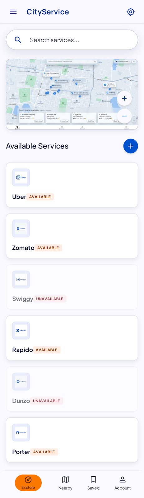

# CityService

Search a locality — right down to a single vasti or society — and see which delivery, ride-hailing, and quick-commerce apps actually serve it, with a confidence rating and provenance for every answer.

Every quick-commerce, delivery, and ride-hailing platform keeps its own private map of where it actually works, and none of them show it to you until after you've installed the app, signed up, and typed in your address. CityService is the missing public index of that coverage.

> **Status: frontend prototype.** Fully built and functional, no backend yet (a mock adapter reads local JSON). Most coverage data is hand-invented placeholder data, clearly marked as such in the UI — see [`PROGRESS.md`](./PROGRESS.md) for what's real vs. seeded.



## Features

- **Search** a locality by name, alias, or pincode (Devanagari-aware), or drop a pin on a map to find the nearest tracked locality
- **Coverage report** per locality: every tracked platform, its status (available / partial / unavailable / unknown), ETA, and a confidence tier (Verified / Likely / Unconfirmed) — a city-level guess can never read as "Verified"
- **Provenance for every answer**: how the answer was resolved (exact locality → same pincode → nearest ancestor) and when it was last checked
- **"Use my location"** — GPS to nearest tracked locality
- **Crowd reporting** — thumbs up/down on any platform recomputes its confidence live
- **Saved localities** and recents, stored locally

## Tech stack

React 18 + Vite + TypeScript (strict) + Tailwind CSS, React Router, Leaflet/OpenStreetMap for maps, Vitest for unit tests. No backend, no accounts, no API keys — everything runs local against seed JSON.

## Getting started

```bash
npm install
npm run dev          # → http://localhost:5173 (also on your LAN IP, for phone testing)
```

Other useful commands:

```bash
npx tsc -b       # type-check
npm run build    # production build
npm test         # vitest
```

Requires Node 20+ and npm 10+.

## Project structure

```
src/
  api/        the data contract + a mock adapter reading src/data (swap for a real backend later, no screen changes)
  domain/     pure resolution/confidence/search logic — server-portable
  data/       seed JSON: Pune localities, platforms, coverage records
  components/ shared UI pieces (cards, map, chips, badges...)
  screens/    one file per route
```

See [`ARCHITECTURE.md`](./ARCHITECTURE.md) for the full data model, the coverage-resolution algorithm, and the planned backend phase.

## Docs

- [`ARCHITECTURE.md`](./ARCHITECTURE.md) — data model, confidence/resolution algorithm, phased backend plan
- [`PROGRESS.md`](./PROGRESS.md) — session handoff notes: what's built, what's real data vs. placeholder, known gaps, where to pick up
- [`DESIGN.md`](./DESIGN.md) — original design tokens/spec

## Known limitations

- Only Pune has real locality data seeded; every other city on the home screen is presentation-only by design
- Most Pune coverage records are placeholder data (`source: "seed-placeholder"`), capped below the "Verified" confidence tier so the demo never overstates certainty — a handful of localities have real, verified checks (see `PROGRESS.md`)
- No backend, no deployment target yet
