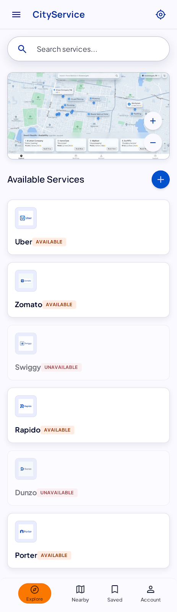

# CityService

Search a locality — right down to a single vasti or society — and see which delivery, ride-hailing, and quick-commerce apps actually serve it, with a confidence rating and provenance for every answer.

Every quick-commerce, delivery, and ride-hailing platform keeps its own private map of where it actually works, and none of them show it to you until after you've installed the app, signed up, and typed in your address. CityService is the missing public index of that coverage.

> **Status: frontend prototype.** Fully built and functional, no backend yet (a mock adapter reads local JSON). Most coverage data is hand-invented placeholder data, clearly marked as such in the UI — see [`PROGRESS.md`](./PROGRESS.md) for what's real vs. seeded.



## Features

- **Search** a locality by name, alias, or pincode (Devanagari-aware), or drop a pin on a map to find the nearest tracked locality
- **Coverage report** per locality: every tracked platform, its status (available / partial / unavailable / unknown), ETA, and a confidence tier (Verified / Likely / Unconfirmed) — a city-level guess can never read as "Verified"
- **Provenance for every answer**: how the answer was resolved (exact locality → same pincode → nearest ancestor) and when it was last checked
- **"Use my location"** — GPS to nearest tracked locality
- **Crowd reporting** — thumbs up/down on any platform recomputes its confidence live
- **Saved localities** and recents, stored locally

## Tech stack

React 18 + Vite + TypeScript (strict) + Tailwind CSS, React Router, Leaflet/OpenStreetMap for maps, Vitest for unit tests. Android wrapper via Capacitor 7 (same `dist/` as the website). No backend, no accounts, no API keys — everything runs local against seed JSON.

## Getting started

```bash
npm install
npm run dev          # → http://localhost:5173 (also on your LAN IP, for phone testing)
```

Other useful commands:

```bash
npx tsc -b       # type-check
npm run build    # production build
npm test         # vitest
```

Requires Node 20+ and npm 10+.

## Android (Capacitor)

The website is unchanged. Capacitor wraps the same Vite `dist/` in a native Android shell so you can install an APK / later publish to Play Store. One codebase, two outputs.

```bash
npm run cap:sync      # production build + copy into android/
npm run cap:android   # sync, then run on a device or emulator
```

Needs **JDK 21** and Android Studio (an emulator or a phone with USB debugging). Capacitor 7’s Gradle build will not compile on JDK 17. First-time setup: open the `android/` folder in Android Studio, set Gradle JDK to 21, and let it sync.

Play Store listing, signing keys, and a privacy-policy URL for the location permission are a later step — not required to run the APK locally.

## Project structure

```
src/
  api/        the data contract + a mock adapter reading src/data (swap for a real backend later, no screen changes)
  domain/     pure resolution/confidence/search logic — server-portable
  data/       seed JSON: Pune localities, platforms, coverage records
  components/ shared UI pieces (cards, map, chips, badges...)
  screens/    one file per route
  lib/        localStorage, GPS helper, Capacitor native shell
android/      Capacitor Android project — same dist/ as the website
scripts/
  pick-next-check.mjs   next (pincode, platform) to check — also `npm run pipeline:pick`
  record-check.mjs      write a live check into checkpoints + coverage
  infer-hubs.mjs        apply Zepto/Blinkit/Instamart inner/edge disks
```

Coverage checks (dev): `npm run dev` then open `/probe`. Copy the place string, set it on the platform site, one-click record. See [`ARCHITECTURE.md`](./ARCHITECTURE.md) §10.

See [`ARCHITECTURE.md`](./ARCHITECTURE.md) for the full data model, the coverage-resolution algorithm, and the planned backend phase.

## Docs

- [`ARCHITECTURE.md`](./ARCHITECTURE.md) — data model, confidence/resolution algorithm, phased backend plan
- [`PROGRESS.md`](./PROGRESS.md) — session handoff notes: what's built, what's real data vs. placeholder, known gaps, where to pick up
- [`DESIGN.md`](./DESIGN.md) — original design tokens/spec

## Known limitations

- Only Pune has real locality data seeded; every other city on the home screen is presentation-only by design
- Most Pune coverage records are placeholder data (`source: "seed-placeholder"`), capped below the "Verified" confidence tier so the demo never overstates certainty — a handful of localities have real, verified checks (see `PROGRESS.md`)
- No backend, no deployment target yet
